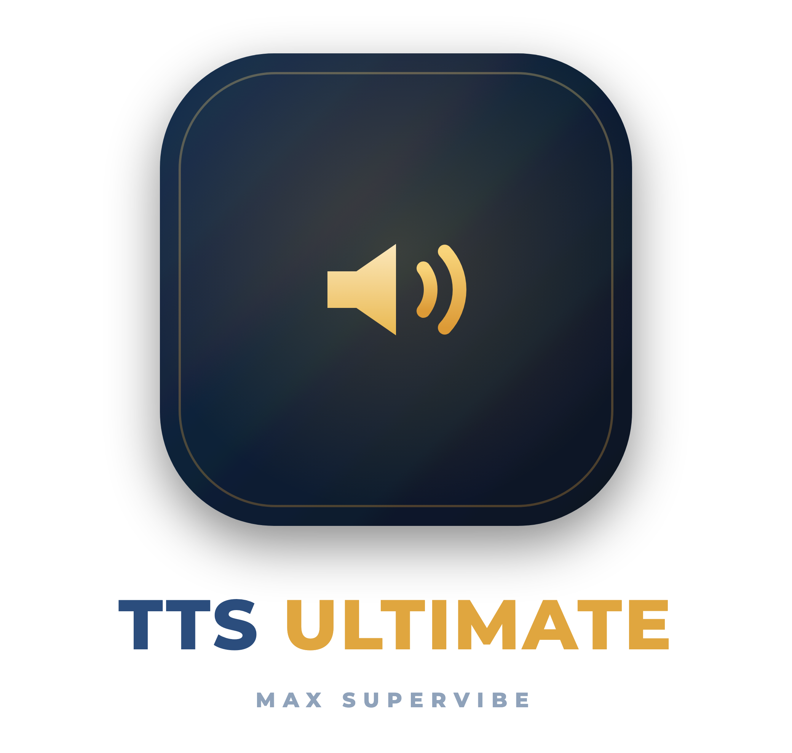

<p align="center">
  
</p>

## Text-to-speech for Node-RED with Sonos, Google Cast, DLNA/UPnP and file-only output.

TTS Ultimate transforms text into speech audio from Node-RED. It can play announcements directly on **Sonos** speakers, **Google Cast** devices (Chromecast / Google Nest) and generic **DLNA/UPnP** renderers such as smart TVs and AV receivers.
It can also work **without player**: generate an audio file, cache it, and pass it to other nodes, web pages, Bluetooth workflows or third-party services. With the OwnFile node, you can upload and play your own audio messages and keep selected flows working completely offline.

<br/>
<br/>
<br/>

<p align="center">
  <a href="https://npmjs.org/package/node-red-contrib-tts-ultimate"></a>
  <a href="https://npmjs.org/package/node-red-contrib-tts-ultimate"></a>
  <a href="https://npmjs.org/package/node-red-contrib-tts-ultimate"></a>
  <a href="https://github.com/Supergiovane/node-red-contrib-tts-ultimate/blob/master/LICENSE"></a>
  <a href="https://standardjs.com"></a>
  <a href="https://www.paypal.me/techtoday"></a>
  <a href="https://www.facebook.com/supergiovaneDev"></a>
</p>

<p align="center">
  
</p>

<p align="center">
  <a href="#description">Description</a> ·
  <a href="#supported-tts-engines">TTS engines</a> ·
  <a href="#supported-players">Players</a> ·
  <a href="#features">Features</a> ·
  <a href="#tts-service-node">Configuration</a> ·
  <a href="#ownfile-node-configuration">OwnFile</a>
</p>

<p align="center">
  
</p>

<details><summary><strong>VIEW SAMPLE FLOW CODE</strong></summary>

> Adjust the nodes according to your setup

```js
[
  {
    id: "569773ae.930abc",
    type: "inject",
    z: "344c547c.b230c4",
    name: "",
    topic: "",
    payload: "true",
    payloadType: "bool",
    repeat: "",
    crontab: "",
    once: false,
    onceDelay: 0.1,
    x: 230,
    y: 300,
    wires: [["e066ce90.46f758"]],
  },
  {
    id: "e066ce90.46f758",
    type: "function",
    z: "344c547c.b230c4",
    name: "Via function",
    func: '// The simplest way\nmsg.payload="Benvenuti,Wilkommen,Wellcome!";\nreturn msg;\n',
    outputs: 1,
    noerr: 0,
    x: 370,
    y: 300,
    wires: [["3d9635bc.53c14a"]],
  },
  {
    id: "c272b47c.41e238",
    type: "inject",
    z: "344c547c.b230c4",
    name: "",
    topic: "",
    payload: "true",
    payloadType: "bool",
    repeat: "",
    crontab: "",
    once: false,
    onceDelay: 0.1,
    x: 230,
    y: 340,
    wires: [["2fcffdb7.1c76ea"]],
  },
  {
    id: "2fcffdb7.1c76ea",
    type: "function",
    z: "344c547c.b230c4",
    name: "Set volume",
    func: '// Set the Volume\nmsg.volume="60"; // If not set, will take the volume from setting page\nmsg.payload="Benvenuti,Wilkommen,Wellcome!";\nreturn msg;\n\n',
    outputs: 1,
    noerr: 0,
    x: 370,
    y: 340,
    wires: [["3d9635bc.53c14a"]],
  },
  {
    id: "2bd6fd7f.9b9ae2",
    type: "inject",
    z: "344c547c.b230c4",
    name: "",
    topic: "",
    payload: "true",
    payloadType: "bool",
    repeat: "",
    crontab: "",
    once: false,
    onceDelay: 0.1,
    x: 230,
    y: 380,
    wires: [["aa3b6e42.669fc"]],
  },
  {
    id: "aa3b6e42.669fc",
    type: "function",
    z: "344c547c.b230c4",
    name: "Array of messages",
    func: '// Create an array of messages\nvar aMessages=[];\n// Add random messages\naMessages.push({volume:"50",payload:"Benvenuti."});\n// Wheater in Italy\naMessages.push({volume:"40",payload:"http://media.ilmeteo.it/audio/2020-12-23.mp3"});\n// Add random messages\naMessages.push({volume:"30",payload:"Cambia la tua voce nei settaggi."});\nreturn [aMessages];\n',
    outputs: 1,
    noerr: 0,
    x: 390,
    y: 380,
    wires: [["3d9635bc.53c14a"]],
  },
  {
    id: "3e0d9b5c.fe01b4",
    type: "inject",
    z: "344c547c.b230c4",
    name: "Hello World",
    topic: "",
    payload: "Ciao Mondo! Come stai?",
    payloadType: "str",
    repeat: "",
    crontab: "",
    once: false,
    onceDelay: 0.1,
    x: 250,
    y: 260,
    wires: [["3d9635bc.53c14a"]],
  },
  {
    id: "42e6fab4.e8d154",
    type: "comment",
    z: "344c547c.b230c4",
    name: "Play text on Sonos. Single player or Group of players",
    info: "",
    x: 360,
    y: 220,
    wires: [],
  },
  {
    id: "3d9635bc.53c14a",
    type: "ttsultimate",
    z: "344c547c.b230c4",
    name: "",
    voice: "Brian",
    ssml: false,
    sonosipaddress: "192.168.1.109",
    sonosvolume: "30",
    sonoshailing: "Hailing_Hailing.mp3",
    config: "557d8082.eb5a8",
    property: "payload",
    propertyType: {},
    rules: [],
    x: 610,
    y: 260,
    wires: [[]],
  },
  {
    id: "557d8082.eb5a8",
    type: "ttsultimate-config",
    z: "",
    name: "googletranslate",
    noderedipaddress: "192.168.1.219",
    noderedport: "1980",
    purgediratrestart: "leave",
    ttsservice: "googletranslate",
  },
];
```

</details>

## SUPPORTED TTS ENGINES

<table>
  <tr>
    <td align="center" width="25%">
      <a href="https://www.npmjs.com/package/google-translate-tts" title="Google Translate TTS (free)">
        
      </a>
      <br/>
      <strong>Google free TTS</strong>
      <br/>
      <sub>No credentials required</sub>
    </td>
    <td align="center" width="25%">
      <a href="https://cloud.google.com/text-to-speech" title="Google Cloud Text-to-Speech">
        
      </a>
      <br/>
      <strong>Google Cloud TTS</strong>
      <br/>
      <sub>Advanced voices and tuning</sub>
    </td>
    <td align="center" width="25%">
      <a href="https://elevenlabs.io" title="ElevenLabs">
        
      </a>
      <br/>
      <strong>ElevenLabs</strong>
      <br/>
      <sub>V1 and V2 multilingual voices</sub>
    </td>
    <td align="center" width="25%">
      <a href="https://voice.ai/docs/api-reference/text-to-speech/generate-speech" title="Voice.ai">
        
      </a>
      <br/>
      <strong>Voice.ai</strong>
      <br/>
      <sub>API key based voices</sub>
    </td>
  </tr>
</table>

## SUPPORTED PLAYERS

<table>
  <tr>
    <td align="center" width="25%">
      <a href="https://www.sonos.com" title="Sonos speakers">
        
      </a>
      <br/>
      <strong>Sonos</strong>
      <br/>
      <sub>Native speakers and groups</sub>
    </td>
    <td align="center" width="25%">
      <a href="https://developers.google.com/cast" title="Google Cast devices">
        
      </a>
      <br/>
      <strong>Google Cast</strong>
      <br/>
      <sub>Chromecast and Google Nest</sub>
    </td>
    <td align="center" width="25%">
      <a href="https://www.dlna.org" title="DLNA and UPnP renderers">
        
      </a>
      <br/>
      <strong>DLNA / UPnP</strong>
      <br/>
      <sub>Smart TVs, AV receivers and renderers</sub>
    </td>
    <td align="center" width="25%">
      
      <br/>
      <strong>No player</strong>
      <br/>
      <sub>Create an audio file only</sub>
    </td>
  </tr>
</table>

## CHANGELOG

- See <a href="https://github.com/Supergiovane/node-red-contrib-tts-ultimate/blob/master/CHANGELOG.md">here the changelog</a>

## FEATURES

- **Native Sonos support**: play TTS audio directly via Sonos, group speakers, set a hailing sound and choose the volume for each speaker.
- **Google Cast support**: play announcements on Chromecast / Google Nest devices, including multi-room playback.
- **DLNA / UPnP renderer support**: play TTS on smart TVs, AV receivers and other UPnP renderers. Renderers with nested MediaRenderer devices are supported too.
- **File-only output**: create the TTS file without using any player, then pass it to other nodes or services.
- **Multiple TTS engines**: Google free TTS, Google Cloud TTS, ElevenLabs and Voice.ai voices are supported.
- **Automatic grouping / multi-room**: add additional players and play one announcement on several devices at once.
- **Automatic discovery**: find Sonos and DLNA/UPnP renderers via SSDP, and Google Cast devices via mDNS.
- **Music resume**: resume the previous queue after an announcement where supported. Some radio-station queues may not resume reliably because of Sonos API limitations.
- **TTS caching**: generated audio is downloaded once and then served from cache. The cache survives reboots and updates.
- **Offline-ready OwnFile playback**: upload custom audio messages and use them without an internet connection.

## BREAKING CHANGE

> **Version 3.0.0 - April 2025**
>
> Amazon Polly and Microsoft Azure TTS have been removed because the old APIs required a larger update. Contributions are welcome via fork and PR. If you still need those TTS engines, stay on or revert to `2.0.10`.

---

<br/>

> **_NOTE IF YOU CANNOT UPLOAD YOUR OWN FILES_**
>
> If you're running Node-RED as a plugin for Home Assistant, RedMatic, etc...<br/>
> You may not be able to upload your own files. Please check that the user running Node-RED has permission **to write to the filesystem**.<br/>

<br/><br/>

## TTS Service Node

Here you can set all parameters you need. All nodes will refer to this config node, so you need to set it only once.<br/>
IF YOU RUN NODE-RED BEHIND DOCKER OR SOMETHING ELSE, BE AWARE: <br/>
PORTS USED BY THE NODE ARE 1980 (DEFAULT, HTTP FILE SERVER) AND 1400 (FOR SONOS DISCOVERY). <br/>
PLEASE ALLOW MDNS AND UDP AS WELL

**TTS Service**<br/>
You can choose between Voice.ai, ElevenLabs.io, Google (without credentials), and Google TTS (requires credentials and registration with Google).<br/>
For Google TTS Engine, you can choose pitch and speed rate of the voice.
<br/>
<br/>

- **TTS Service using Google (without credentials)**<br/>
  This is the simplest way. Just select the voice and you're done. You don't need any credential and you don't even need to be registered to any Google service. The voice list is more limited than other services, but it works without hassles.
  Note: long texts are automatically split into 200-character chunks (Google Translate TTS limit) and merged into a single audio output.
  Manual verify: `npm run verify:googletranslate-split -- --voice it-IT --text "..." --out ./out.mp3`

<br/>

- **TTS Service using Google TTS**<br/>
  For Google TTS Engine, you can choose pitch and speed rate of the voice.<br/>
  **Google credentials file path**<br/>
  Here you must select your credential file, previously downloaded from Google, [with these steps](https://www.npmjs.com/package/@google-cloud/text-to-speech):
  > [Select or create a Cloud Platform project](https://console.cloud.google.com/project)<br/>
  > [Enable billing for your project](https://support.google.com/cloud/answer/6293499#enable-billing)<br/>
  > [Enable the Google Cloud Text-to-Speech API](https://console.cloud.google.com/flows/enableapi?apiid=texttospeech.googleapis.com)<br/>

<br/>

- **TTS Service using ElevenLabs**<br/>
  Please use the V2 engine, as the V1 is deprecated and will no longer be supported. The V2 has multilingual voices and is more powerful.<br/>
  You have two choices: register to ElevenLabs, or do not register. If you don't register to ElevenLabs.io, you will either have access to a limited amount of voices, or no access at all.<br/>
  After registration at ElevenLabs.io, you can add any language to your personal list. The personal list will then be shown in the node voice list.<br/>
  <br/>

- **TTS Service using Voice.ai**<br/>
  Add your Voice.ai API key in the config node, deploy and restart Node-RED. The node will load your available voices and show them in the Voice dropdown.<br/>
  Note: SSML is not supported by this engine.
  <br/>

**Node-RED IP**<br/>
Set IP of your Node-RED machine. Write **AUTODISCOVER** to allow the node to auto discover your IP.

**Host Port**<br/>
The players (Sonos, Google Cast, DLNA/UPnP renderers) will connect to this port to fetch the TTS audio. Default 1980. Choose a free port. Do not use 1880 or any other port already in use on your computer. The port must be reachable from the players on your network.

Note: if you use multiple `ttsultimate-config` nodes, each one now keeps its own TTS cache folder; the “purge on restart/deploy” option only affects that config node’s cache.

**TTS Cache**
<br/>
**_Purge and delete the TTS cache folder at deploy or restart_**<br/>
On each deploy or node-red restart, delete all tts files in the cache. This is useful not to run out of disk space, in case you've a lot of TTS speech files.
<br/>
**_Leave the TTS cache folder untouched_** (suggested only if you have enough disk space)<br/>
Don't delete the files cached. Useful if you wish to keep the tts files, even in case of internet outages, node-red restart or reboots.
<br/>

**Cache root folder**
<br/>
Set your preferred output folder for the files downloaded by the TTS Engine.<br/>
This is useful if you wish to save the TTS cached files in a folder accessible, for example, by a third party web servers to serve an AirPlay2 speaker.<br/>
Leave this field blank for the default.<br/>
<br/>
<br/>

## TTS-Ultimate Node

### INPUT MESSAGES TO THE NODE <br/>

_Examples_

```js
// Play a message
msg.payload = "Hello, the current temperature is 12°";
return msg;
```

```js
// Play a message, forcing no hailing
msg.nohailing = true;
msg.payload = "I won't disturb with my hailing, this time.";
return msg;
```

```js
// Play a message with custom voice ID
msg.payload = "Hello, the current temperature is 12°";
msg.voiceId = 2;
return msg;
```

```js
// Play smoke detection
msg.sonoshailing = "SmokeAlert";
msg.payload =
  "Warning, smoke detected. Fire extinguishers are in the kitchen, hall and garage.";
return msg;
```

```js
// Play an mp3
msg.sonoshailing = "MeteoJingle";
msg.payload = "http://192.125.22.44/meteotoday.mp3";
return msg;
```

```js
// Play priority message
msg.priority = true;
msg.payload = "Warning. Intruder in the dinning room.";
return msg;
```

```js
// Stop whatever is playing
msg.stop = true;
return msg;
```

### CHANGE CONFIGURATION VIA MSG PROPERTY

You can change the configuration of tts-ultimate, _via msg.setConfig_ property.<br/>
The property is a JSON object.


```js
// Set main player IP
// The setting is retained until the node receives another msg.setConfig or until node-red is restarted.
var config = {
  setMainPlayerIP: "192.168.1.109",
};
msg.setConfig = config;
return msg;
```

```js
// Set player IP and additional players with their optional adapted volume, relative to the main sonos player volume.
// You can specify the aditional player's volume adaptation
// The setting is retained until the node receives another msg.setConfig or until node-red is restarted.
var config = {
  setMainPlayerIP: "192.168.1.109",
  setPlayerGroupArray: [
    "192.168.1.110", // This additional player will use the same volume as the main sonos player.
    "192.168.1.111#-10", // This additional player will use the main sonos player's volume, minus 10.
    "192.168.1.112#20", // This additional player will use the main sonos player's volume, plus 20.
  ],
};
msg.setConfig = config;
return msg;
```

```js
// If you have only one additional player, without setting their adjusted volume.
// The setting is retained until the node receives another msg.setConfig or until node-red is restarted.
var config = {
  setMainPlayerIP: "192.168.1.109",
  setPlayerGroupArray: ["192.168.1.110"],
};
msg.setConfig = config;
return msg;
```

<br/>

<details><summary> VIEW SAMPLE CODE</summary>

> Adjust the nodes according to your setup

```js
[
  {
    id: "4b4514d.047366c",
    type: "ttsultimate",
    z: "235d8e3d.a7583a",
    name: "",
    voice: "de-DE",
    ssml: false,
    sonosipaddress: "192.168.1.109",
    sonosvolume: "5",
    sonoshailing: "0",
    config: "feee307e.54bca",
    property: "payload",
    propertyType: {},
    rules: [],
    x: 430,
    y: 360,
    wires: [["2b2d7556.251d0a"], ["2978fe86.e680aa"]],
  },
  {
    id: "2b2d7556.251d0a",
    type: "debug",
    z: "235d8e3d.a7583a",
    name: "",
    active: true,
    tosidebar: true,
    console: false,
    tostatus: false,
    complete: "true",
    targetType: "full",
    statusVal: "",
    statusType: "auto",
    x: 610,
    y: 340,
    wires: [],
  },
  {
    id: "2978fe86.e680aa",
    type: "debug",
    z: "235d8e3d.a7583a",
    name: "",
    active: true,
    tosidebar: true,
    console: false,
    tostatus: false,
    complete: "true",
    targetType: "full",
    statusVal: "",
    statusType: "auto",
    x: 610,
    y: 380,
    wires: [],
  },
  {
    id: "9d9e06be.09718",
    type: "function",
    z: "235d8e3d.a7583a",
    name: "Change Config",
    func: '// Set the main player IP and each IP belonging to the player\'s group\nvar config= {\n    setMainPlayerIP:"192.168.1.109",\n    setPlayerGroupArray:[\n        "192.168.1.110",\n        "192.168.1.111",\n        "192.168.1.112"\n    ]\n};\nmsg.setConfig = config;\nreturn msg;',
    outputs: 1,
    noerr: 0,
    initialize: "",
    finalize: "",
    x: 260,
    y: 360,
    wires: [["4b4514d.047366c"]],
  },
  {
    id: "c3da8b3a.e8f2c8",
    type: "inject",
    z: "235d8e3d.a7583a",
    name: "",
    props: [{ p: "payload" }],
    repeat: "",
    crontab: "",
    once: false,
    onceDelay: 0.1,
    topic: "",
    payload: "Hello",
    payloadType: "str",
    x: 110,
    y: 360,
    wires: [["9d9e06be.09718"]],
  },
  {
    id: "c55b7140.4a7cc8",
    type: "comment",
    z: "235d8e3d.a7583a",
    name: "Change the player and/or group of players via msg property.",
    info: "",
    x: 270,
    y: 300,
    wires: [],
  },
  {
    id: "feee307e.54bca",
    type: "ttsultimate-config",
    name: "Config",
    noderedipaddress: "192.168.1.161",
    noderedport: "1980",
    purgediratrestart: "leave",
    ttsservice: "googletranslate",
  },
];
```

</details>

<br/>
<br/>

## OwnFile Node Configuration


<br/>

<details><summary> VIEW SAMPLE CODE</summary>

> Adjust the nodes according to your setup

```js
[
  {
    id: "db0ea33.f1186e",
    type: "ttsultimate",
    z: "c6efd2b6.ab02e8",
    name: "",
    voice: "en-AU-Standard-A#en-AU#FEMALE",
    ssml: false,
    sonosipaddress: "192.168.1.109",
    sonosvolume: "25",
    sonoshailing: "Hailing_Hailing.mp3",
    config: "4f941d61.f52c4c",
    propertyType: {},
    rules: [],
    x: 670,
    y: 240,
    wires: [[]],
  },
  {
    id: "c7fb2970.271978",
    type: "ownfileultimate",
    z: "c6efd2b6.ab02e8",
    name: "",
    selectedFile: "OwnFile_Tur geoeffnet.mp3",
    x: 490,
    y: 220,
    wires: [["db0ea33.f1186e"]],
  },
  {
    id: "fef80c5b.49f9e",
    type: "inject",
    z: "c6efd2b6.ab02e8",
    name: "",
    topic: "",
    payload: "true",
    payloadType: "bool",
    repeat: "",
    crontab: "",
    once: false,
    onceDelay: 0.1,
    x: 130,
    y: 220,
    wires: [["c7fb2970.271978"]],
  },
  {
    id: "807f0f6c.6d59c",
    type: "comment",
    z: "c6efd2b6.ab02e8",
    name: "You can upload your own voice messages and use it with ttsultimate",
    info: "",
    x: 310,
    y: 180,
    wires: [],
  },
  {
    id: "536e58b3.bb8468",
    type: "ownfileultimate",
    z: "c6efd2b6.ab02e8",
    name: "",
    selectedFile: "OwnFile_Tur geoeffnet.mp3",
    x: 490,
    y: 260,
    wires: [["db0ea33.f1186e"]],
  },
  {
    id: "26c339f9.346fbe",
    type: "inject",
    z: "c6efd2b6.ab02e8",
    name: "",
    topic: "",
    payload: "true",
    payloadType: "bool",
    repeat: "",
    crontab: "",
    once: false,
    onceDelay: 0.1,
    x: 130,
    y: 260,
    wires: [["25016441.6447bc"]],
  },
  {
    id: "25016441.6447bc",
    type: "function",
    z: "c6efd2b6.ab02e8",
    name: "Dynamically Select file",
    func: '// Override the selected file.\nmsg.selectedFile="Porta aperta"\nreturn msg;',
    outputs: 1,
    noerr: 0,
    x: 300,
    y: 260,
    wires: [["536e58b3.bb8468"]],
  },
  {
    id: "4f941d61.f52c4c",
    type: "ttsultimate-config",
    z: "",
    name: "GoogleTTS",
    noderedipaddress: "192.168.1.219",
    noderedport: "1980",
    purgediratrestart: "leave",
    ttsservice: "googletts",
  },
];
```

</details>

This node allows you to upload your custom message and play it via TTS Ultimate without the need for an internet connection. You can use it, for example, with your alarm panel to announce a zone breach, a doorbell or similar events.

**Name**<br/>
Node name

**File to be played** <br/>
Select a file to be played. You can upload one or multiple files at the same time via the "upload" button.

**Priority**<br/>
If set to <b>true</b>, the OwnFile message will cancel the current TTS queue, will stop the current phrase being spoken and the TTS-Ultimate node will play this priority message.<br/>
Please refer to _msg.priority_ msg input property of TTS-Ultimate for info on how this message will be handled<br/>

### INPUT MESSAGE

**msg.payload = true**<br/>
Begin play of the message <br/>

**msg.selectedFile = "Garage door open"** <br/>
Overrides the selected message and plays the filename you passed in. Please double check the spelling of the filename (must be the same as you can see in the dropdown list of your own files, in the node config window) and do not include the <b>.mp3</b> extension.<br/>

**msg.priority**<br/>
If set to <b>true</b>, the OwnFile message will cancel the current TTS queue, will stop the current phrase being spoken and the TTS-Ultimate node will play this priority message.<br/>
Please refer to _msg.priority_ msg input property of TTS-Ultimate for info on how this message will be handled<br/>


[license-image]: https://img.shields.io/badge/license-MIT-blue.svg
[license-url]: https://github.com/Supergiovane/node-red-contrib-tts-ultimate/blob/master/LICENSE
[npm-url]: https://npmjs.org/package/node-red-contrib-tts-ultimate
[npm-version-image]: https://img.shields.io/npm/v/node-red-contrib-tts-ultimate.svg
[npm-downloads-month-image]: https://img.shields.io/npm/dm/node-red-contrib-tts-ultimate.svg
[npm-downloads-total-image]: https://img.shields.io/npm/dt/node-red-contrib-tts-ultimate.svg
[facebook-image]: https://img.shields.io/badge/Visit%20me-Facebook-blue
[facebook-url]: https://www.facebook.com/supergiovaneDev
